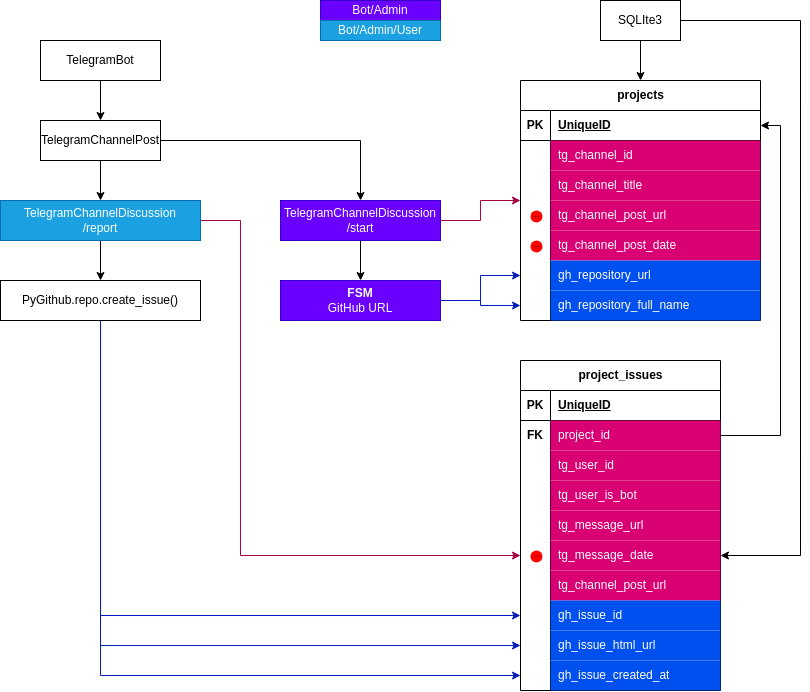
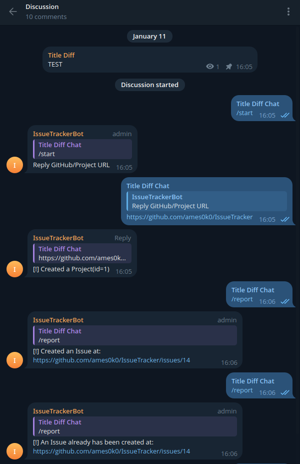

<p align="center">2-min of a Development Video: <a href="https://youtu.be/tZ79tViF9ME">YouTube</a></p>
<p align="center"></p>
<hr />
<p align="center"></p>
<p align="center"></p>

```
sqlite> .tables
project_issues  projects
sqlite> select * from projects;
1|-1002471158929|Title Diff|https://t.me/c/2176290202/299|2025-01-13 00:22:47|https://github.com/ames0k0/IssueTracker/issues/19|ames0k0/IssueTracker
sqlite> select * from project_issues ;
2|1|1087968824|1|https://t.me/c/2176290202/343|2025-01-13 13:08:36|https://t.me/c/2176290202/299|2783918864|https://github.com/ames0k0/IssueTracker/issues/21|2025-01-13 13:08:37
```